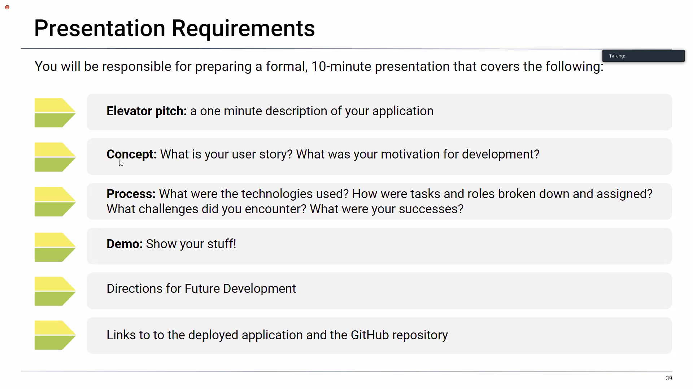

,,,
# group-project
In class project for group 8.

## Guidelines

## Presentation

,,,

,,,
## Day 1 Outline

## Project

* Traveler's Insight
  * This site allows you to explore and find current events and diffrenet native cuisines in cities you are interested in traveling to.

## User Story

AS A traveler,
I WANT to find new events and restaurants in a city that I am going to,
SO THAT I can experience new things!

## APIs
* Zomato
* Ticketmaster
